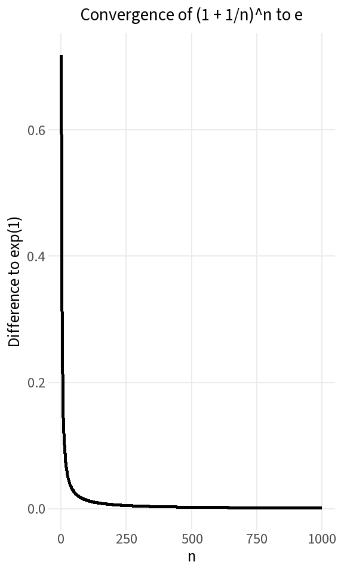
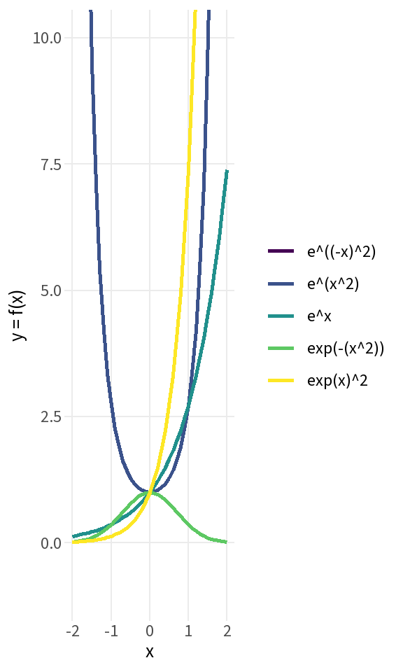
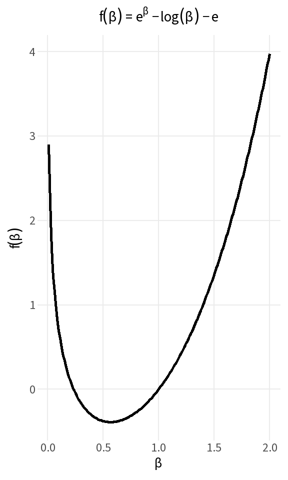
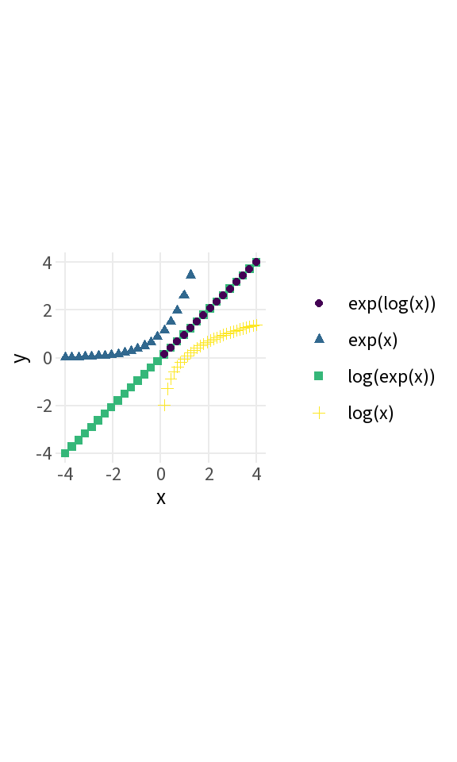

# Exercise 1: Estimate *e*


::: {.cell}

```{.r .cell-code}
n_vals <- c(1, 2, 5, 10)

for (n in n_vals) {
  e_est <- (1 + 1/n)^n
  cat(sprintf("n: %2.0f,  est.e: %6.5f,  diff to e: %9.7f\n",
              n, e_est, exp(1) - e_est))
}
```

::: {.cell-output .cell-output-stdout}

```
n:  1,  est.e: 2.00000,  diff to e: 0.7182818
n:  2,  est.e: 2.25000,  diff to e: 0.4682818
n:  5,  est.e: 2.48832,  diff to e: 0.2299618
n: 10,  est.e: 2.59374,  diff to e: 0.1245394
```


:::
:::


# Exercise 2: Visualize *e*'s convergence


::: {.cell}

```{.r .cell-code}
n <- 1:1000
e_diffs <- exp(1) - (1 + 1/n)^n

ggplot(data.frame(n = n, diff = e_diffs), aes(n, diff)) +
  geom_line(linewidth = 1) +
  labs(x = "n", y = "Difference to exp(1)",
       title = "Convergence of (1 + 1/n)^n to e")
```

::: {.cell-output-display}
{width=288}
:::
:::


# Exercise 3: Exploring *e* in R


::: {.cell}

```{.r .cell-code}
x_domain <- c(-2, 2)
x <- seq(x_domain[1], x_domain[2], length.out = 41)

data.frame(
  x   = x,
  `e^x`          = exp(x),
  `e^(x^2)`      = exp(x^2),
  `e^((-x)^2)`   = exp((-x)^2),
  `exp(-(x^2))`  = exp(-(x^2)),
  `exp(x)^2`     = exp(x)^2,
  check.names = FALSE
) |>
  pivot_longer(-x, names_to = "fun", values_to = "y") |>
  ggplot(aes(x = x, y = y, color = fun)) +
  geom_line(linewidth = 1) +
  coord_cartesian(xlim = x_domain, ylim = c(-1, 10)) +
  labs(x = "x", y = "y = f(x)", color = NULL) +
  theme(legend.position = "right")
```

::: {.cell-output-display}
{width=288}
:::
:::


# Exercise 4: Exploring *e* in R (symbolic-style expression)

In Python, SymPy plotted `exp(beta) - log(beta) - e` symbolically.
In R we evaluate and plot the same function directly over a numeric grid.


::: {.cell}

```{.r .cell-code}
beta <- seq(0.01, 2, length.out = 200)   # avoid log(0)
y    <- exp(beta) - log(beta) - exp(1)

ggplot(data.frame(beta = beta, y = y), aes(beta, y)) +
  geom_line(linewidth = 1) +
  labs(x = expression(beta),
       y = expression(f(beta)),
       title = expression(f(beta) == e^beta - log(beta) - e))
```

::: {.cell-output-display}
{width=288}
:::
:::


# Exercise 5: Exp and log as mutual inverses


::: {.cell}

```{.r .cell-code}
x_log <- seq(0.001, 4, length.out = 30)
x_exp <- seq(-4, 4, length.out = 30)

df <- rbind(
  data.frame(x = x_log, y = log(x_log),              fun = "log(x)"),
  data.frame(x = x_exp, y = exp(x_exp),              fun = "exp(x)"),
  data.frame(x = x_exp, y = log(exp(x_exp)),         fun = "log(exp(x))"),
  data.frame(x = x_exp, y = exp(log(x_exp)),         fun = "exp(log(x))")
)

ggplot(df, aes(x = x, y = y, color = fun, shape = fun)) +
  geom_point(size = 1.5) +
  coord_fixed(xlim = c(-4, 4), ylim = c(-4, 4)) +
  labs(x = "x", y = "y", color = NULL, shape = NULL)
```

::: {.cell-output-display}
{width=288}
:::
:::

