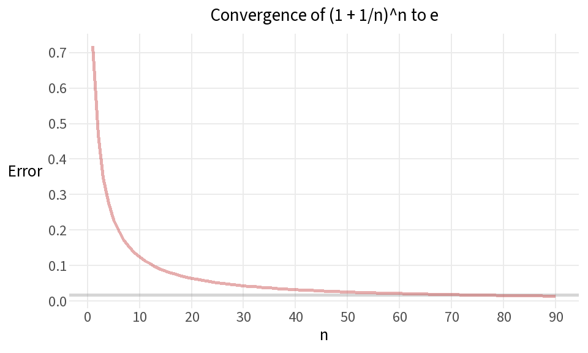
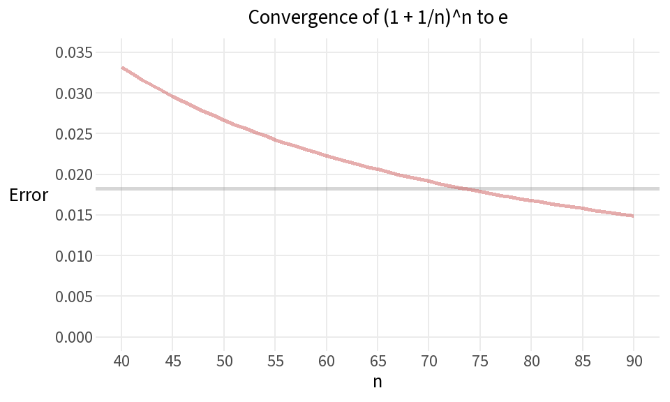
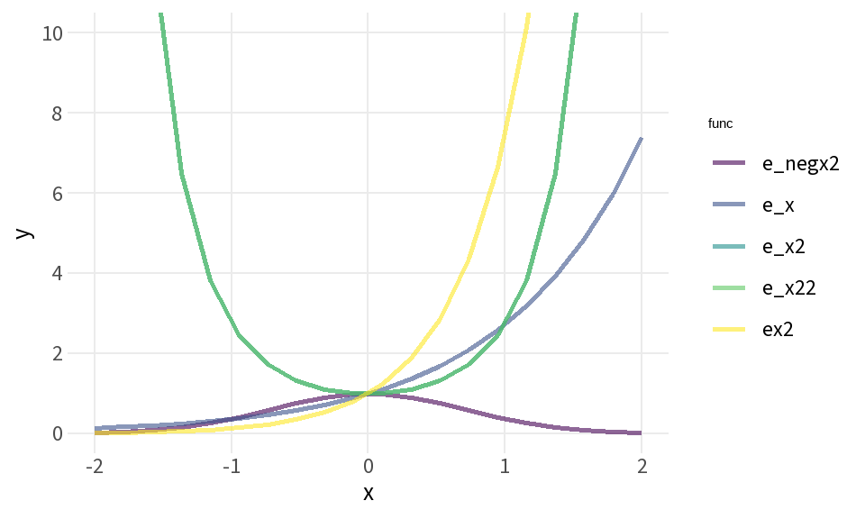
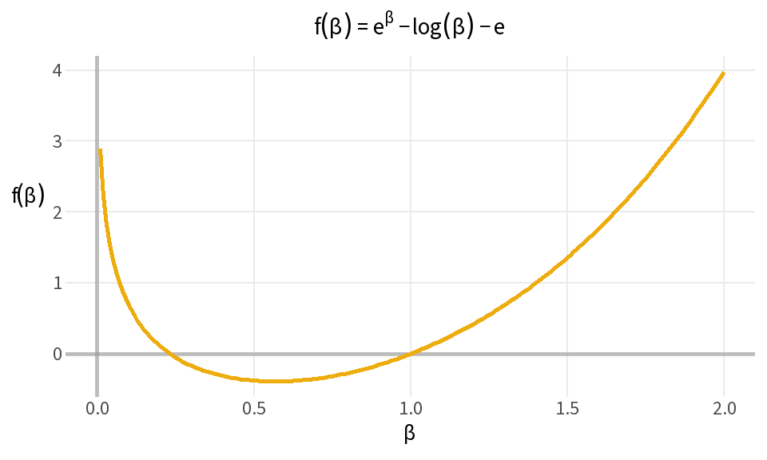
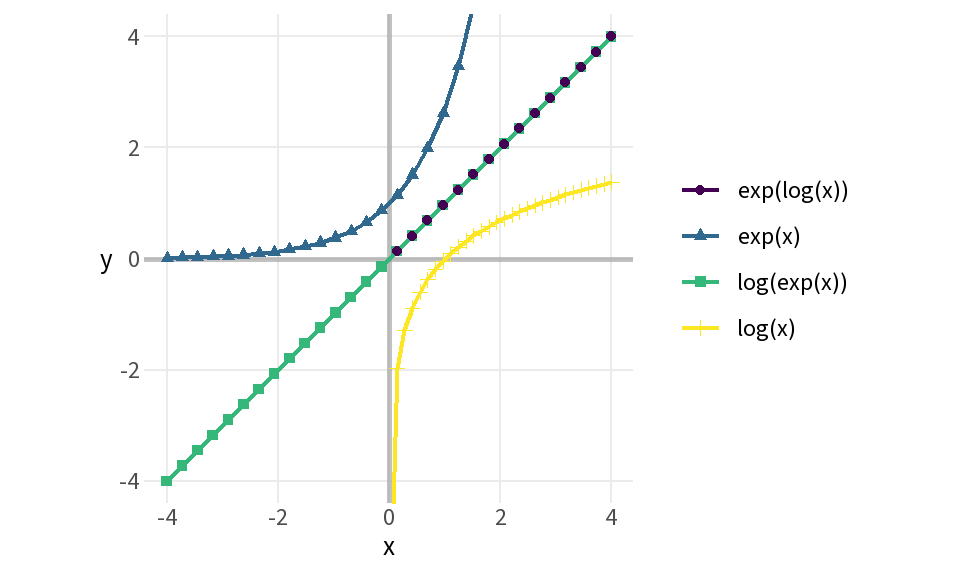

# Exercise 1: Estimate *e*

Where does *e* come from?

There are several ways to express / define *e*. Here's the way to express it in terms of limits. 

$$e=\lim_{n\to\infty}\left(1+\frac{1}{n}\right)^n$$


::: {.cell}

```{.r .cell-code}
n <- 1:90

exp_est <- tibble(n,
                  e_est=NA, 
                  e_diff=NA)

for (i in n) {
  exp_est$e_est[i] <- (1 + 1/n[i])^n[i]
  exp_est$e_diff[i] = exp(1) - exp_est$e_est[i]
}
```
:::


:::{.columns}

:::{.column width="33%"}

::: {.cell}

```{.r .cell-code}
exp_est %>%
    head(30) %>%
    flextable()
```

::: {.cell-output-display}

```{=html}
<div class="tabwid"><style>.cl-0cf194d2{table-layout:auto;}.cl-0ce54fec{font-family:'Gill Sans MT';font-size:10pt;font-weight:normal;font-style:normal;text-decoration:none;color:rgba(0, 0, 0, 1.00);background-color:transparent;}.cl-0cea02e4{margin:0;text-align:right;border-bottom: 0 solid rgba(0, 0, 0, 1.00);border-top: 0 solid rgba(0, 0, 0, 1.00);border-left: 0 solid rgba(0, 0, 0, 1.00);border-right: 0 solid rgba(0, 0, 0, 1.00);padding-bottom:5pt;padding-top:5pt;padding-left:5pt;padding-right:5pt;line-height: 1;background-color:transparent;}.cl-0cea62e8{background-color:transparent;vertical-align: middle;border-bottom: 1.5pt solid rgba(102, 102, 102, 1.00);border-top: 1.5pt solid rgba(102, 102, 102, 1.00);border-left: 0 solid rgba(0, 0, 0, 1.00);border-right: 0 solid rgba(0, 0, 0, 1.00);margin-bottom:0;margin-top:0;margin-left:0;margin-right:0;}.cl-0cea62f2{background-color:transparent;vertical-align: middle;border-bottom: 0 solid rgba(0, 0, 0, 1.00);border-top: 0 solid rgba(0, 0, 0, 1.00);border-left: 0 solid rgba(0, 0, 0, 1.00);border-right: 0 solid rgba(0, 0, 0, 1.00);margin-bottom:0;margin-top:0;margin-left:0;margin-right:0;}.cl-0cea62fc{background-color:transparent;vertical-align: middle;border-bottom: 1.5pt solid rgba(102, 102, 102, 1.00);border-top: 0 solid rgba(0, 0, 0, 1.00);border-left: 0 solid rgba(0, 0, 0, 1.00);border-right: 0 solid rgba(0, 0, 0, 1.00);margin-bottom:0;margin-top:0;margin-left:0;margin-right:0;}</style><table data-quarto-disable-processing='true' class='cl-0cf194d2'><thead><tr style="overflow-wrap:break-word;"><th class="cl-0cea62e8"><p class="cl-0cea02e4"><span class="cl-0ce54fec">n</span></p></th><th class="cl-0cea62e8"><p class="cl-0cea02e4"><span class="cl-0ce54fec">e_est</span></p></th><th class="cl-0cea62e8"><p class="cl-0cea02e4"><span class="cl-0ce54fec">e_diff</span></p></th></tr></thead><tbody><tr style="overflow-wrap:break-word;"><td class="cl-0cea62f2"><p class="cl-0cea02e4"><span class="cl-0ce54fec">1</span></p></td><td class="cl-0cea62f2"><p class="cl-0cea02e4"><span class="cl-0ce54fec">2.00</span></p></td><td class="cl-0cea62f2"><p class="cl-0cea02e4"><span class="cl-0ce54fec">0.7183</span></p></td></tr><tr style="overflow-wrap:break-word;"><td class="cl-0cea62f2"><p class="cl-0cea02e4"><span class="cl-0ce54fec">2</span></p></td><td class="cl-0cea62f2"><p class="cl-0cea02e4"><span class="cl-0ce54fec">2.25</span></p></td><td class="cl-0cea62f2"><p class="cl-0cea02e4"><span class="cl-0ce54fec">0.4683</span></p></td></tr><tr style="overflow-wrap:break-word;"><td class="cl-0cea62f2"><p class="cl-0cea02e4"><span class="cl-0ce54fec">3</span></p></td><td class="cl-0cea62f2"><p class="cl-0cea02e4"><span class="cl-0ce54fec">2.37</span></p></td><td class="cl-0cea62f2"><p class="cl-0cea02e4"><span class="cl-0ce54fec">0.3479</span></p></td></tr><tr style="overflow-wrap:break-word;"><td class="cl-0cea62f2"><p class="cl-0cea02e4"><span class="cl-0ce54fec">4</span></p></td><td class="cl-0cea62f2"><p class="cl-0cea02e4"><span class="cl-0ce54fec">2.44</span></p></td><td class="cl-0cea62f2"><p class="cl-0cea02e4"><span class="cl-0ce54fec">0.2769</span></p></td></tr><tr style="overflow-wrap:break-word;"><td class="cl-0cea62f2"><p class="cl-0cea02e4"><span class="cl-0ce54fec">5</span></p></td><td class="cl-0cea62f2"><p class="cl-0cea02e4"><span class="cl-0ce54fec">2.49</span></p></td><td class="cl-0cea62f2"><p class="cl-0cea02e4"><span class="cl-0ce54fec">0.2300</span></p></td></tr><tr style="overflow-wrap:break-word;"><td class="cl-0cea62f2"><p class="cl-0cea02e4"><span class="cl-0ce54fec">6</span></p></td><td class="cl-0cea62f2"><p class="cl-0cea02e4"><span class="cl-0ce54fec">2.52</span></p></td><td class="cl-0cea62f2"><p class="cl-0cea02e4"><span class="cl-0ce54fec">0.1967</span></p></td></tr><tr style="overflow-wrap:break-word;"><td class="cl-0cea62f2"><p class="cl-0cea02e4"><span class="cl-0ce54fec">7</span></p></td><td class="cl-0cea62f2"><p class="cl-0cea02e4"><span class="cl-0ce54fec">2.55</span></p></td><td class="cl-0cea62f2"><p class="cl-0cea02e4"><span class="cl-0ce54fec">0.1718</span></p></td></tr><tr style="overflow-wrap:break-word;"><td class="cl-0cea62f2"><p class="cl-0cea02e4"><span class="cl-0ce54fec">8</span></p></td><td class="cl-0cea62f2"><p class="cl-0cea02e4"><span class="cl-0ce54fec">2.57</span></p></td><td class="cl-0cea62f2"><p class="cl-0cea02e4"><span class="cl-0ce54fec">0.1525</span></p></td></tr><tr style="overflow-wrap:break-word;"><td class="cl-0cea62f2"><p class="cl-0cea02e4"><span class="cl-0ce54fec">9</span></p></td><td class="cl-0cea62f2"><p class="cl-0cea02e4"><span class="cl-0ce54fec">2.58</span></p></td><td class="cl-0cea62f2"><p class="cl-0cea02e4"><span class="cl-0ce54fec">0.1371</span></p></td></tr><tr style="overflow-wrap:break-word;"><td class="cl-0cea62f2"><p class="cl-0cea02e4"><span class="cl-0ce54fec">10</span></p></td><td class="cl-0cea62f2"><p class="cl-0cea02e4"><span class="cl-0ce54fec">2.59</span></p></td><td class="cl-0cea62f2"><p class="cl-0cea02e4"><span class="cl-0ce54fec">0.1245</span></p></td></tr><tr style="overflow-wrap:break-word;"><td class="cl-0cea62f2"><p class="cl-0cea02e4"><span class="cl-0ce54fec">11</span></p></td><td class="cl-0cea62f2"><p class="cl-0cea02e4"><span class="cl-0ce54fec">2.60</span></p></td><td class="cl-0cea62f2"><p class="cl-0cea02e4"><span class="cl-0ce54fec">0.1141</span></p></td></tr><tr style="overflow-wrap:break-word;"><td class="cl-0cea62f2"><p class="cl-0cea02e4"><span class="cl-0ce54fec">12</span></p></td><td class="cl-0cea62f2"><p class="cl-0cea02e4"><span class="cl-0ce54fec">2.61</span></p></td><td class="cl-0cea62f2"><p class="cl-0cea02e4"><span class="cl-0ce54fec">0.1052</span></p></td></tr><tr style="overflow-wrap:break-word;"><td class="cl-0cea62f2"><p class="cl-0cea02e4"><span class="cl-0ce54fec">13</span></p></td><td class="cl-0cea62f2"><p class="cl-0cea02e4"><span class="cl-0ce54fec">2.62</span></p></td><td class="cl-0cea62f2"><p class="cl-0cea02e4"><span class="cl-0ce54fec">0.0977</span></p></td></tr><tr style="overflow-wrap:break-word;"><td class="cl-0cea62f2"><p class="cl-0cea02e4"><span class="cl-0ce54fec">14</span></p></td><td class="cl-0cea62f2"><p class="cl-0cea02e4"><span class="cl-0ce54fec">2.63</span></p></td><td class="cl-0cea62f2"><p class="cl-0cea02e4"><span class="cl-0ce54fec">0.0911</span></p></td></tr><tr style="overflow-wrap:break-word;"><td class="cl-0cea62f2"><p class="cl-0cea02e4"><span class="cl-0ce54fec">15</span></p></td><td class="cl-0cea62f2"><p class="cl-0cea02e4"><span class="cl-0ce54fec">2.63</span></p></td><td class="cl-0cea62f2"><p class="cl-0cea02e4"><span class="cl-0ce54fec">0.0854</span></p></td></tr><tr style="overflow-wrap:break-word;"><td class="cl-0cea62f2"><p class="cl-0cea02e4"><span class="cl-0ce54fec">16</span></p></td><td class="cl-0cea62f2"><p class="cl-0cea02e4"><span class="cl-0ce54fec">2.64</span></p></td><td class="cl-0cea62f2"><p class="cl-0cea02e4"><span class="cl-0ce54fec">0.0804</span></p></td></tr><tr style="overflow-wrap:break-word;"><td class="cl-0cea62f2"><p class="cl-0cea02e4"><span class="cl-0ce54fec">17</span></p></td><td class="cl-0cea62f2"><p class="cl-0cea02e4"><span class="cl-0ce54fec">2.64</span></p></td><td class="cl-0cea62f2"><p class="cl-0cea02e4"><span class="cl-0ce54fec">0.0759</span></p></td></tr><tr style="overflow-wrap:break-word;"><td class="cl-0cea62f2"><p class="cl-0cea02e4"><span class="cl-0ce54fec">18</span></p></td><td class="cl-0cea62f2"><p class="cl-0cea02e4"><span class="cl-0ce54fec">2.65</span></p></td><td class="cl-0cea62f2"><p class="cl-0cea02e4"><span class="cl-0ce54fec">0.0719</span></p></td></tr><tr style="overflow-wrap:break-word;"><td class="cl-0cea62f2"><p class="cl-0cea02e4"><span class="cl-0ce54fec">19</span></p></td><td class="cl-0cea62f2"><p class="cl-0cea02e4"><span class="cl-0ce54fec">2.65</span></p></td><td class="cl-0cea62f2"><p class="cl-0cea02e4"><span class="cl-0ce54fec">0.0682</span></p></td></tr><tr style="overflow-wrap:break-word;"><td class="cl-0cea62f2"><p class="cl-0cea02e4"><span class="cl-0ce54fec">20</span></p></td><td class="cl-0cea62f2"><p class="cl-0cea02e4"><span class="cl-0ce54fec">2.65</span></p></td><td class="cl-0cea62f2"><p class="cl-0cea02e4"><span class="cl-0ce54fec">0.0650</span></p></td></tr><tr style="overflow-wrap:break-word;"><td class="cl-0cea62f2"><p class="cl-0cea02e4"><span class="cl-0ce54fec">21</span></p></td><td class="cl-0cea62f2"><p class="cl-0cea02e4"><span class="cl-0ce54fec">2.66</span></p></td><td class="cl-0cea62f2"><p class="cl-0cea02e4"><span class="cl-0ce54fec">0.0620</span></p></td></tr><tr style="overflow-wrap:break-word;"><td class="cl-0cea62f2"><p class="cl-0cea02e4"><span class="cl-0ce54fec">22</span></p></td><td class="cl-0cea62f2"><p class="cl-0cea02e4"><span class="cl-0ce54fec">2.66</span></p></td><td class="cl-0cea62f2"><p class="cl-0cea02e4"><span class="cl-0ce54fec">0.0593</span></p></td></tr><tr style="overflow-wrap:break-word;"><td class="cl-0cea62f2"><p class="cl-0cea02e4"><span class="cl-0ce54fec">23</span></p></td><td class="cl-0cea62f2"><p class="cl-0cea02e4"><span class="cl-0ce54fec">2.66</span></p></td><td class="cl-0cea62f2"><p class="cl-0cea02e4"><span class="cl-0ce54fec">0.0568</span></p></td></tr><tr style="overflow-wrap:break-word;"><td class="cl-0cea62f2"><p class="cl-0cea02e4"><span class="cl-0ce54fec">24</span></p></td><td class="cl-0cea62f2"><p class="cl-0cea02e4"><span class="cl-0ce54fec">2.66</span></p></td><td class="cl-0cea62f2"><p class="cl-0cea02e4"><span class="cl-0ce54fec">0.0546</span></p></td></tr><tr style="overflow-wrap:break-word;"><td class="cl-0cea62f2"><p class="cl-0cea02e4"><span class="cl-0ce54fec">25</span></p></td><td class="cl-0cea62f2"><p class="cl-0cea02e4"><span class="cl-0ce54fec">2.67</span></p></td><td class="cl-0cea62f2"><p class="cl-0cea02e4"><span class="cl-0ce54fec">0.0524</span></p></td></tr><tr style="overflow-wrap:break-word;"><td class="cl-0cea62f2"><p class="cl-0cea02e4"><span class="cl-0ce54fec">26</span></p></td><td class="cl-0cea62f2"><p class="cl-0cea02e4"><span class="cl-0ce54fec">2.67</span></p></td><td class="cl-0cea62f2"><p class="cl-0cea02e4"><span class="cl-0ce54fec">0.0505</span></p></td></tr><tr style="overflow-wrap:break-word;"><td class="cl-0cea62f2"><p class="cl-0cea02e4"><span class="cl-0ce54fec">27</span></p></td><td class="cl-0cea62f2"><p class="cl-0cea02e4"><span class="cl-0ce54fec">2.67</span></p></td><td class="cl-0cea62f2"><p class="cl-0cea02e4"><span class="cl-0ce54fec">0.0487</span></p></td></tr><tr style="overflow-wrap:break-word;"><td class="cl-0cea62f2"><p class="cl-0cea02e4"><span class="cl-0ce54fec">28</span></p></td><td class="cl-0cea62f2"><p class="cl-0cea02e4"><span class="cl-0ce54fec">2.67</span></p></td><td class="cl-0cea62f2"><p class="cl-0cea02e4"><span class="cl-0ce54fec">0.0470</span></p></td></tr><tr style="overflow-wrap:break-word;"><td class="cl-0cea62f2"><p class="cl-0cea02e4"><span class="cl-0ce54fec">29</span></p></td><td class="cl-0cea62f2"><p class="cl-0cea02e4"><span class="cl-0ce54fec">2.67</span></p></td><td class="cl-0cea62f2"><p class="cl-0cea02e4"><span class="cl-0ce54fec">0.0454</span></p></td></tr><tr style="overflow-wrap:break-word;"><td class="cl-0cea62fc"><p class="cl-0cea02e4"><span class="cl-0ce54fec">30</span></p></td><td class="cl-0cea62fc"><p class="cl-0cea02e4"><span class="cl-0ce54fec">2.67</span></p></td><td class="cl-0cea62fc"><p class="cl-0cea02e4"><span class="cl-0ce54fec">0.0440</span></p></td></tr></tbody></table></div>
```

:::
:::

:::

::: {.column width="33%"}

::: {.cell}

```{.r .cell-code}
exp_est %>%
    .[31:60,] %>%
    flextable()
```

::: {.cell-output-display}

```{=html}
<div class="tabwid"><style>.cl-0d156c90{table-layout:auto;}.cl-0d0d51e0{font-family:'Gill Sans MT';font-size:10pt;font-weight:normal;font-style:normal;text-decoration:none;color:rgba(0, 0, 0, 1.00);background-color:transparent;}.cl-0d1097ba{margin:0;text-align:right;border-bottom: 0 solid rgba(0, 0, 0, 1.00);border-top: 0 solid rgba(0, 0, 0, 1.00);border-left: 0 solid rgba(0, 0, 0, 1.00);border-right: 0 solid rgba(0, 0, 0, 1.00);padding-bottom:5pt;padding-top:5pt;padding-left:5pt;padding-right:5pt;line-height: 1;background-color:transparent;}.cl-0d10b6aa{background-color:transparent;vertical-align: middle;border-bottom: 1.5pt solid rgba(102, 102, 102, 1.00);border-top: 1.5pt solid rgba(102, 102, 102, 1.00);border-left: 0 solid rgba(0, 0, 0, 1.00);border-right: 0 solid rgba(0, 0, 0, 1.00);margin-bottom:0;margin-top:0;margin-left:0;margin-right:0;}.cl-0d10b6b4{background-color:transparent;vertical-align: middle;border-bottom: 0 solid rgba(0, 0, 0, 1.00);border-top: 0 solid rgba(0, 0, 0, 1.00);border-left: 0 solid rgba(0, 0, 0, 1.00);border-right: 0 solid rgba(0, 0, 0, 1.00);margin-bottom:0;margin-top:0;margin-left:0;margin-right:0;}.cl-0d10b6be{background-color:transparent;vertical-align: middle;border-bottom: 1.5pt solid rgba(102, 102, 102, 1.00);border-top: 0 solid rgba(0, 0, 0, 1.00);border-left: 0 solid rgba(0, 0, 0, 1.00);border-right: 0 solid rgba(0, 0, 0, 1.00);margin-bottom:0;margin-top:0;margin-left:0;margin-right:0;}</style><table data-quarto-disable-processing='true' class='cl-0d156c90'><thead><tr style="overflow-wrap:break-word;"><th class="cl-0d10b6aa"><p class="cl-0d1097ba"><span class="cl-0d0d51e0">n</span></p></th><th class="cl-0d10b6aa"><p class="cl-0d1097ba"><span class="cl-0d0d51e0">e_est</span></p></th><th class="cl-0d10b6aa"><p class="cl-0d1097ba"><span class="cl-0d0d51e0">e_diff</span></p></th></tr></thead><tbody><tr style="overflow-wrap:break-word;"><td class="cl-0d10b6b4"><p class="cl-0d1097ba"><span class="cl-0d0d51e0">31</span></p></td><td class="cl-0d10b6b4"><p class="cl-0d1097ba"><span class="cl-0d0d51e0">2.68</span></p></td><td class="cl-0d10b6b4"><p class="cl-0d1097ba"><span class="cl-0d0d51e0">0.0426</span></p></td></tr><tr style="overflow-wrap:break-word;"><td class="cl-0d10b6b4"><p class="cl-0d1097ba"><span class="cl-0d0d51e0">32</span></p></td><td class="cl-0d10b6b4"><p class="cl-0d1097ba"><span class="cl-0d0d51e0">2.68</span></p></td><td class="cl-0d10b6b4"><p class="cl-0d1097ba"><span class="cl-0d0d51e0">0.0413</span></p></td></tr><tr style="overflow-wrap:break-word;"><td class="cl-0d10b6b4"><p class="cl-0d1097ba"><span class="cl-0d0d51e0">33</span></p></td><td class="cl-0d10b6b4"><p class="cl-0d1097ba"><span class="cl-0d0d51e0">2.68</span></p></td><td class="cl-0d10b6b4"><p class="cl-0d1097ba"><span class="cl-0d0d51e0">0.0401</span></p></td></tr><tr style="overflow-wrap:break-word;"><td class="cl-0d10b6b4"><p class="cl-0d1097ba"><span class="cl-0d0d51e0">34</span></p></td><td class="cl-0d10b6b4"><p class="cl-0d1097ba"><span class="cl-0d0d51e0">2.68</span></p></td><td class="cl-0d10b6b4"><p class="cl-0d1097ba"><span class="cl-0d0d51e0">0.0389</span></p></td></tr><tr style="overflow-wrap:break-word;"><td class="cl-0d10b6b4"><p class="cl-0d1097ba"><span class="cl-0d0d51e0">35</span></p></td><td class="cl-0d10b6b4"><p class="cl-0d1097ba"><span class="cl-0d0d51e0">2.68</span></p></td><td class="cl-0d10b6b4"><p class="cl-0d1097ba"><span class="cl-0d0d51e0">0.0378</span></p></td></tr><tr style="overflow-wrap:break-word;"><td class="cl-0d10b6b4"><p class="cl-0d1097ba"><span class="cl-0d0d51e0">36</span></p></td><td class="cl-0d10b6b4"><p class="cl-0d1097ba"><span class="cl-0d0d51e0">2.68</span></p></td><td class="cl-0d10b6b4"><p class="cl-0d1097ba"><span class="cl-0d0d51e0">0.0368</span></p></td></tr><tr style="overflow-wrap:break-word;"><td class="cl-0d10b6b4"><p class="cl-0d1097ba"><span class="cl-0d0d51e0">37</span></p></td><td class="cl-0d10b6b4"><p class="cl-0d1097ba"><span class="cl-0d0d51e0">2.68</span></p></td><td class="cl-0d10b6b4"><p class="cl-0d1097ba"><span class="cl-0d0d51e0">0.0358</span></p></td></tr><tr style="overflow-wrap:break-word;"><td class="cl-0d10b6b4"><p class="cl-0d1097ba"><span class="cl-0d0d51e0">38</span></p></td><td class="cl-0d10b6b4"><p class="cl-0d1097ba"><span class="cl-0d0d51e0">2.68</span></p></td><td class="cl-0d10b6b4"><p class="cl-0d1097ba"><span class="cl-0d0d51e0">0.0349</span></p></td></tr><tr style="overflow-wrap:break-word;"><td class="cl-0d10b6b4"><p class="cl-0d1097ba"><span class="cl-0d0d51e0">39</span></p></td><td class="cl-0d10b6b4"><p class="cl-0d1097ba"><span class="cl-0d0d51e0">2.68</span></p></td><td class="cl-0d10b6b4"><p class="cl-0d1097ba"><span class="cl-0d0d51e0">0.0341</span></p></td></tr><tr style="overflow-wrap:break-word;"><td class="cl-0d10b6b4"><p class="cl-0d1097ba"><span class="cl-0d0d51e0">40</span></p></td><td class="cl-0d10b6b4"><p class="cl-0d1097ba"><span class="cl-0d0d51e0">2.69</span></p></td><td class="cl-0d10b6b4"><p class="cl-0d1097ba"><span class="cl-0d0d51e0">0.0332</span></p></td></tr><tr style="overflow-wrap:break-word;"><td class="cl-0d10b6b4"><p class="cl-0d1097ba"><span class="cl-0d0d51e0">41</span></p></td><td class="cl-0d10b6b4"><p class="cl-0d1097ba"><span class="cl-0d0d51e0">2.69</span></p></td><td class="cl-0d10b6b4"><p class="cl-0d1097ba"><span class="cl-0d0d51e0">0.0324</span></p></td></tr><tr style="overflow-wrap:break-word;"><td class="cl-0d10b6b4"><p class="cl-0d1097ba"><span class="cl-0d0d51e0">42</span></p></td><td class="cl-0d10b6b4"><p class="cl-0d1097ba"><span class="cl-0d0d51e0">2.69</span></p></td><td class="cl-0d10b6b4"><p class="cl-0d1097ba"><span class="cl-0d0d51e0">0.0317</span></p></td></tr><tr style="overflow-wrap:break-word;"><td class="cl-0d10b6b4"><p class="cl-0d1097ba"><span class="cl-0d0d51e0">43</span></p></td><td class="cl-0d10b6b4"><p class="cl-0d1097ba"><span class="cl-0d0d51e0">2.69</span></p></td><td class="cl-0d10b6b4"><p class="cl-0d1097ba"><span class="cl-0d0d51e0">0.0309</span></p></td></tr><tr style="overflow-wrap:break-word;"><td class="cl-0d10b6b4"><p class="cl-0d1097ba"><span class="cl-0d0d51e0">44</span></p></td><td class="cl-0d10b6b4"><p class="cl-0d1097ba"><span class="cl-0d0d51e0">2.69</span></p></td><td class="cl-0d10b6b4"><p class="cl-0d1097ba"><span class="cl-0d0d51e0">0.0303</span></p></td></tr><tr style="overflow-wrap:break-word;"><td class="cl-0d10b6b4"><p class="cl-0d1097ba"><span class="cl-0d0d51e0">45</span></p></td><td class="cl-0d10b6b4"><p class="cl-0d1097ba"><span class="cl-0d0d51e0">2.69</span></p></td><td class="cl-0d10b6b4"><p class="cl-0d1097ba"><span class="cl-0d0d51e0">0.0296</span></p></td></tr><tr style="overflow-wrap:break-word;"><td class="cl-0d10b6b4"><p class="cl-0d1097ba"><span class="cl-0d0d51e0">46</span></p></td><td class="cl-0d10b6b4"><p class="cl-0d1097ba"><span class="cl-0d0d51e0">2.69</span></p></td><td class="cl-0d10b6b4"><p class="cl-0d1097ba"><span class="cl-0d0d51e0">0.0290</span></p></td></tr><tr style="overflow-wrap:break-word;"><td class="cl-0d10b6b4"><p class="cl-0d1097ba"><span class="cl-0d0d51e0">47</span></p></td><td class="cl-0d10b6b4"><p class="cl-0d1097ba"><span class="cl-0d0d51e0">2.69</span></p></td><td class="cl-0d10b6b4"><p class="cl-0d1097ba"><span class="cl-0d0d51e0">0.0284</span></p></td></tr><tr style="overflow-wrap:break-word;"><td class="cl-0d10b6b4"><p class="cl-0d1097ba"><span class="cl-0d0d51e0">48</span></p></td><td class="cl-0d10b6b4"><p class="cl-0d1097ba"><span class="cl-0d0d51e0">2.69</span></p></td><td class="cl-0d10b6b4"><p class="cl-0d1097ba"><span class="cl-0d0d51e0">0.0278</span></p></td></tr><tr style="overflow-wrap:break-word;"><td class="cl-0d10b6b4"><p class="cl-0d1097ba"><span class="cl-0d0d51e0">49</span></p></td><td class="cl-0d10b6b4"><p class="cl-0d1097ba"><span class="cl-0d0d51e0">2.69</span></p></td><td class="cl-0d10b6b4"><p class="cl-0d1097ba"><span class="cl-0d0d51e0">0.0272</span></p></td></tr><tr style="overflow-wrap:break-word;"><td class="cl-0d10b6b4"><p class="cl-0d1097ba"><span class="cl-0d0d51e0">50</span></p></td><td class="cl-0d10b6b4"><p class="cl-0d1097ba"><span class="cl-0d0d51e0">2.69</span></p></td><td class="cl-0d10b6b4"><p class="cl-0d1097ba"><span class="cl-0d0d51e0">0.0267</span></p></td></tr><tr style="overflow-wrap:break-word;"><td class="cl-0d10b6b4"><p class="cl-0d1097ba"><span class="cl-0d0d51e0">51</span></p></td><td class="cl-0d10b6b4"><p class="cl-0d1097ba"><span class="cl-0d0d51e0">2.69</span></p></td><td class="cl-0d10b6b4"><p class="cl-0d1097ba"><span class="cl-0d0d51e0">0.0262</span></p></td></tr><tr style="overflow-wrap:break-word;"><td class="cl-0d10b6b4"><p class="cl-0d1097ba"><span class="cl-0d0d51e0">52</span></p></td><td class="cl-0d10b6b4"><p class="cl-0d1097ba"><span class="cl-0d0d51e0">2.69</span></p></td><td class="cl-0d10b6b4"><p class="cl-0d1097ba"><span class="cl-0d0d51e0">0.0257</span></p></td></tr><tr style="overflow-wrap:break-word;"><td class="cl-0d10b6b4"><p class="cl-0d1097ba"><span class="cl-0d0d51e0">53</span></p></td><td class="cl-0d10b6b4"><p class="cl-0d1097ba"><span class="cl-0d0d51e0">2.69</span></p></td><td class="cl-0d10b6b4"><p class="cl-0d1097ba"><span class="cl-0d0d51e0">0.0252</span></p></td></tr><tr style="overflow-wrap:break-word;"><td class="cl-0d10b6b4"><p class="cl-0d1097ba"><span class="cl-0d0d51e0">54</span></p></td><td class="cl-0d10b6b4"><p class="cl-0d1097ba"><span class="cl-0d0d51e0">2.69</span></p></td><td class="cl-0d10b6b4"><p class="cl-0d1097ba"><span class="cl-0d0d51e0">0.0247</span></p></td></tr><tr style="overflow-wrap:break-word;"><td class="cl-0d10b6b4"><p class="cl-0d1097ba"><span class="cl-0d0d51e0">55</span></p></td><td class="cl-0d10b6b4"><p class="cl-0d1097ba"><span class="cl-0d0d51e0">2.69</span></p></td><td class="cl-0d10b6b4"><p class="cl-0d1097ba"><span class="cl-0d0d51e0">0.0243</span></p></td></tr><tr style="overflow-wrap:break-word;"><td class="cl-0d10b6b4"><p class="cl-0d1097ba"><span class="cl-0d0d51e0">56</span></p></td><td class="cl-0d10b6b4"><p class="cl-0d1097ba"><span class="cl-0d0d51e0">2.69</span></p></td><td class="cl-0d10b6b4"><p class="cl-0d1097ba"><span class="cl-0d0d51e0">0.0239</span></p></td></tr><tr style="overflow-wrap:break-word;"><td class="cl-0d10b6b4"><p class="cl-0d1097ba"><span class="cl-0d0d51e0">57</span></p></td><td class="cl-0d10b6b4"><p class="cl-0d1097ba"><span class="cl-0d0d51e0">2.69</span></p></td><td class="cl-0d10b6b4"><p class="cl-0d1097ba"><span class="cl-0d0d51e0">0.0235</span></p></td></tr><tr style="overflow-wrap:break-word;"><td class="cl-0d10b6b4"><p class="cl-0d1097ba"><span class="cl-0d0d51e0">58</span></p></td><td class="cl-0d10b6b4"><p class="cl-0d1097ba"><span class="cl-0d0d51e0">2.70</span></p></td><td class="cl-0d10b6b4"><p class="cl-0d1097ba"><span class="cl-0d0d51e0">0.0231</span></p></td></tr><tr style="overflow-wrap:break-word;"><td class="cl-0d10b6b4"><p class="cl-0d1097ba"><span class="cl-0d0d51e0">59</span></p></td><td class="cl-0d10b6b4"><p class="cl-0d1097ba"><span class="cl-0d0d51e0">2.70</span></p></td><td class="cl-0d10b6b4"><p class="cl-0d1097ba"><span class="cl-0d0d51e0">0.0227</span></p></td></tr><tr style="overflow-wrap:break-word;"><td class="cl-0d10b6be"><p class="cl-0d1097ba"><span class="cl-0d0d51e0">60</span></p></td><td class="cl-0d10b6be"><p class="cl-0d1097ba"><span class="cl-0d0d51e0">2.70</span></p></td><td class="cl-0d10b6be"><p class="cl-0d1097ba"><span class="cl-0d0d51e0">0.0223</span></p></td></tr></tbody></table></div>
```

:::
:::

:::

::: {.column width="33%"}

::: {.cell}

```{.r .cell-code}
exp_est %>%
    tail(30) %>%
    flextable()
```

::: {.cell-output-display}

```{=html}
<div class="tabwid"><style>.cl-0d2da846{table-layout:auto;}.cl-0d250420{font-family:'Gill Sans MT';font-size:10pt;font-weight:normal;font-style:normal;text-decoration:none;color:rgba(0, 0, 0, 1.00);background-color:transparent;}.cl-0d28db36{margin:0;text-align:right;border-bottom: 0 solid rgba(0, 0, 0, 1.00);border-top: 0 solid rgba(0, 0, 0, 1.00);border-left: 0 solid rgba(0, 0, 0, 1.00);border-right: 0 solid rgba(0, 0, 0, 1.00);padding-bottom:5pt;padding-top:5pt;padding-left:5pt;padding-right:5pt;line-height: 1;background-color:transparent;}.cl-0d2908f4{background-color:transparent;vertical-align: middle;border-bottom: 1.5pt solid rgba(102, 102, 102, 1.00);border-top: 1.5pt solid rgba(102, 102, 102, 1.00);border-left: 0 solid rgba(0, 0, 0, 1.00);border-right: 0 solid rgba(0, 0, 0, 1.00);margin-bottom:0;margin-top:0;margin-left:0;margin-right:0;}.cl-0d2908fe{background-color:transparent;vertical-align: middle;border-bottom: 0 solid rgba(0, 0, 0, 1.00);border-top: 0 solid rgba(0, 0, 0, 1.00);border-left: 0 solid rgba(0, 0, 0, 1.00);border-right: 0 solid rgba(0, 0, 0, 1.00);margin-bottom:0;margin-top:0;margin-left:0;margin-right:0;}.cl-0d290908{background-color:transparent;vertical-align: middle;border-bottom: 1.5pt solid rgba(102, 102, 102, 1.00);border-top: 0 solid rgba(0, 0, 0, 1.00);border-left: 0 solid rgba(0, 0, 0, 1.00);border-right: 0 solid rgba(0, 0, 0, 1.00);margin-bottom:0;margin-top:0;margin-left:0;margin-right:0;}</style><table data-quarto-disable-processing='true' class='cl-0d2da846'><thead><tr style="overflow-wrap:break-word;"><th class="cl-0d2908f4"><p class="cl-0d28db36"><span class="cl-0d250420">n</span></p></th><th class="cl-0d2908f4"><p class="cl-0d28db36"><span class="cl-0d250420">e_est</span></p></th><th class="cl-0d2908f4"><p class="cl-0d28db36"><span class="cl-0d250420">e_diff</span></p></th></tr></thead><tbody><tr style="overflow-wrap:break-word;"><td class="cl-0d2908fe"><p class="cl-0d28db36"><span class="cl-0d250420">61</span></p></td><td class="cl-0d2908fe"><p class="cl-0d28db36"><span class="cl-0d250420">2.7</span></p></td><td class="cl-0d2908fe"><p class="cl-0d28db36"><span class="cl-0d250420">0.0220</span></p></td></tr><tr style="overflow-wrap:break-word;"><td class="cl-0d2908fe"><p class="cl-0d28db36"><span class="cl-0d250420">62</span></p></td><td class="cl-0d2908fe"><p class="cl-0d28db36"><span class="cl-0d250420">2.7</span></p></td><td class="cl-0d2908fe"><p class="cl-0d28db36"><span class="cl-0d250420">0.0216</span></p></td></tr><tr style="overflow-wrap:break-word;"><td class="cl-0d2908fe"><p class="cl-0d28db36"><span class="cl-0d250420">63</span></p></td><td class="cl-0d2908fe"><p class="cl-0d28db36"><span class="cl-0d250420">2.7</span></p></td><td class="cl-0d2908fe"><p class="cl-0d28db36"><span class="cl-0d250420">0.0213</span></p></td></tr><tr style="overflow-wrap:break-word;"><td class="cl-0d2908fe"><p class="cl-0d28db36"><span class="cl-0d250420">64</span></p></td><td class="cl-0d2908fe"><p class="cl-0d28db36"><span class="cl-0d250420">2.7</span></p></td><td class="cl-0d2908fe"><p class="cl-0d28db36"><span class="cl-0d250420">0.0209</span></p></td></tr><tr style="overflow-wrap:break-word;"><td class="cl-0d2908fe"><p class="cl-0d28db36"><span class="cl-0d250420">65</span></p></td><td class="cl-0d2908fe"><p class="cl-0d28db36"><span class="cl-0d250420">2.7</span></p></td><td class="cl-0d2908fe"><p class="cl-0d28db36"><span class="cl-0d250420">0.0206</span></p></td></tr><tr style="overflow-wrap:break-word;"><td class="cl-0d2908fe"><p class="cl-0d28db36"><span class="cl-0d250420">66</span></p></td><td class="cl-0d2908fe"><p class="cl-0d28db36"><span class="cl-0d250420">2.7</span></p></td><td class="cl-0d2908fe"><p class="cl-0d28db36"><span class="cl-0d250420">0.0203</span></p></td></tr><tr style="overflow-wrap:break-word;"><td class="cl-0d2908fe"><p class="cl-0d28db36"><span class="cl-0d250420">67</span></p></td><td class="cl-0d2908fe"><p class="cl-0d28db36"><span class="cl-0d250420">2.7</span></p></td><td class="cl-0d2908fe"><p class="cl-0d28db36"><span class="cl-0d250420">0.0200</span></p></td></tr><tr style="overflow-wrap:break-word;"><td class="cl-0d2908fe"><p class="cl-0d28db36"><span class="cl-0d250420">68</span></p></td><td class="cl-0d2908fe"><p class="cl-0d28db36"><span class="cl-0d250420">2.7</span></p></td><td class="cl-0d2908fe"><p class="cl-0d28db36"><span class="cl-0d250420">0.0197</span></p></td></tr><tr style="overflow-wrap:break-word;"><td class="cl-0d2908fe"><p class="cl-0d28db36"><span class="cl-0d250420">69</span></p></td><td class="cl-0d2908fe"><p class="cl-0d28db36"><span class="cl-0d250420">2.7</span></p></td><td class="cl-0d2908fe"><p class="cl-0d28db36"><span class="cl-0d250420">0.0194</span></p></td></tr><tr style="overflow-wrap:break-word;"><td class="cl-0d2908fe"><p class="cl-0d28db36"><span class="cl-0d250420">70</span></p></td><td class="cl-0d2908fe"><p class="cl-0d28db36"><span class="cl-0d250420">2.7</span></p></td><td class="cl-0d2908fe"><p class="cl-0d28db36"><span class="cl-0d250420">0.0192</span></p></td></tr><tr style="overflow-wrap:break-word;"><td class="cl-0d2908fe"><p class="cl-0d28db36"><span class="cl-0d250420">71</span></p></td><td class="cl-0d2908fe"><p class="cl-0d28db36"><span class="cl-0d250420">2.7</span></p></td><td class="cl-0d2908fe"><p class="cl-0d28db36"><span class="cl-0d250420">0.0189</span></p></td></tr><tr style="overflow-wrap:break-word;"><td class="cl-0d2908fe"><p class="cl-0d28db36"><span class="cl-0d250420">72</span></p></td><td class="cl-0d2908fe"><p class="cl-0d28db36"><span class="cl-0d250420">2.7</span></p></td><td class="cl-0d2908fe"><p class="cl-0d28db36"><span class="cl-0d250420">0.0186</span></p></td></tr><tr style="overflow-wrap:break-word;"><td class="cl-0d2908fe"><p class="cl-0d28db36"><span class="cl-0d250420">73</span></p></td><td class="cl-0d2908fe"><p class="cl-0d28db36"><span class="cl-0d250420">2.7</span></p></td><td class="cl-0d2908fe"><p class="cl-0d28db36"><span class="cl-0d250420">0.0184</span></p></td></tr><tr style="overflow-wrap:break-word;"><td class="cl-0d2908fe"><p class="cl-0d28db36"><span class="cl-0d250420">74</span></p></td><td class="cl-0d2908fe"><p class="cl-0d28db36"><span class="cl-0d250420">2.7</span></p></td><td class="cl-0d2908fe"><p class="cl-0d28db36"><span class="cl-0d250420">0.0181</span></p></td></tr><tr style="overflow-wrap:break-word;"><td class="cl-0d2908fe"><p class="cl-0d28db36"><span class="cl-0d250420">75</span></p></td><td class="cl-0d2908fe"><p class="cl-0d28db36"><span class="cl-0d250420">2.7</span></p></td><td class="cl-0d2908fe"><p class="cl-0d28db36"><span class="cl-0d250420">0.0179</span></p></td></tr><tr style="overflow-wrap:break-word;"><td class="cl-0d2908fe"><p class="cl-0d28db36"><span class="cl-0d250420">76</span></p></td><td class="cl-0d2908fe"><p class="cl-0d28db36"><span class="cl-0d250420">2.7</span></p></td><td class="cl-0d2908fe"><p class="cl-0d28db36"><span class="cl-0d250420">0.0177</span></p></td></tr><tr style="overflow-wrap:break-word;"><td class="cl-0d2908fe"><p class="cl-0d28db36"><span class="cl-0d250420">77</span></p></td><td class="cl-0d2908fe"><p class="cl-0d28db36"><span class="cl-0d250420">2.7</span></p></td><td class="cl-0d2908fe"><p class="cl-0d28db36"><span class="cl-0d250420">0.0174</span></p></td></tr><tr style="overflow-wrap:break-word;"><td class="cl-0d2908fe"><p class="cl-0d28db36"><span class="cl-0d250420">78</span></p></td><td class="cl-0d2908fe"><p class="cl-0d28db36"><span class="cl-0d250420">2.7</span></p></td><td class="cl-0d2908fe"><p class="cl-0d28db36"><span class="cl-0d250420">0.0172</span></p></td></tr><tr style="overflow-wrap:break-word;"><td class="cl-0d2908fe"><p class="cl-0d28db36"><span class="cl-0d250420">79</span></p></td><td class="cl-0d2908fe"><p class="cl-0d28db36"><span class="cl-0d250420">2.7</span></p></td><td class="cl-0d2908fe"><p class="cl-0d28db36"><span class="cl-0d250420">0.0170</span></p></td></tr><tr style="overflow-wrap:break-word;"><td class="cl-0d2908fe"><p class="cl-0d28db36"><span class="cl-0d250420">80</span></p></td><td class="cl-0d2908fe"><p class="cl-0d28db36"><span class="cl-0d250420">2.7</span></p></td><td class="cl-0d2908fe"><p class="cl-0d28db36"><span class="cl-0d250420">0.0168</span></p></td></tr><tr style="overflow-wrap:break-word;"><td class="cl-0d2908fe"><p class="cl-0d28db36"><span class="cl-0d250420">81</span></p></td><td class="cl-0d2908fe"><p class="cl-0d28db36"><span class="cl-0d250420">2.7</span></p></td><td class="cl-0d2908fe"><p class="cl-0d28db36"><span class="cl-0d250420">0.0166</span></p></td></tr><tr style="overflow-wrap:break-word;"><td class="cl-0d2908fe"><p class="cl-0d28db36"><span class="cl-0d250420">82</span></p></td><td class="cl-0d2908fe"><p class="cl-0d28db36"><span class="cl-0d250420">2.7</span></p></td><td class="cl-0d2908fe"><p class="cl-0d28db36"><span class="cl-0d250420">0.0164</span></p></td></tr><tr style="overflow-wrap:break-word;"><td class="cl-0d2908fe"><p class="cl-0d28db36"><span class="cl-0d250420">83</span></p></td><td class="cl-0d2908fe"><p class="cl-0d28db36"><span class="cl-0d250420">2.7</span></p></td><td class="cl-0d2908fe"><p class="cl-0d28db36"><span class="cl-0d250420">0.0162</span></p></td></tr><tr style="overflow-wrap:break-word;"><td class="cl-0d2908fe"><p class="cl-0d28db36"><span class="cl-0d250420">84</span></p></td><td class="cl-0d2908fe"><p class="cl-0d28db36"><span class="cl-0d250420">2.7</span></p></td><td class="cl-0d2908fe"><p class="cl-0d28db36"><span class="cl-0d250420">0.0160</span></p></td></tr><tr style="overflow-wrap:break-word;"><td class="cl-0d2908fe"><p class="cl-0d28db36"><span class="cl-0d250420">85</span></p></td><td class="cl-0d2908fe"><p class="cl-0d28db36"><span class="cl-0d250420">2.7</span></p></td><td class="cl-0d2908fe"><p class="cl-0d28db36"><span class="cl-0d250420">0.0158</span></p></td></tr><tr style="overflow-wrap:break-word;"><td class="cl-0d2908fe"><p class="cl-0d28db36"><span class="cl-0d250420">86</span></p></td><td class="cl-0d2908fe"><p class="cl-0d28db36"><span class="cl-0d250420">2.7</span></p></td><td class="cl-0d2908fe"><p class="cl-0d28db36"><span class="cl-0d250420">0.0156</span></p></td></tr><tr style="overflow-wrap:break-word;"><td class="cl-0d2908fe"><p class="cl-0d28db36"><span class="cl-0d250420">87</span></p></td><td class="cl-0d2908fe"><p class="cl-0d28db36"><span class="cl-0d250420">2.7</span></p></td><td class="cl-0d2908fe"><p class="cl-0d28db36"><span class="cl-0d250420">0.0155</span></p></td></tr><tr style="overflow-wrap:break-word;"><td class="cl-0d2908fe"><p class="cl-0d28db36"><span class="cl-0d250420">88</span></p></td><td class="cl-0d2908fe"><p class="cl-0d28db36"><span class="cl-0d250420">2.7</span></p></td><td class="cl-0d2908fe"><p class="cl-0d28db36"><span class="cl-0d250420">0.0153</span></p></td></tr><tr style="overflow-wrap:break-word;"><td class="cl-0d2908fe"><p class="cl-0d28db36"><span class="cl-0d250420">89</span></p></td><td class="cl-0d2908fe"><p class="cl-0d28db36"><span class="cl-0d250420">2.7</span></p></td><td class="cl-0d2908fe"><p class="cl-0d28db36"><span class="cl-0d250420">0.0151</span></p></td></tr><tr style="overflow-wrap:break-word;"><td class="cl-0d290908"><p class="cl-0d28db36"><span class="cl-0d250420">90</span></p></td><td class="cl-0d290908"><p class="cl-0d28db36"><span class="cl-0d250420">2.7</span></p></td><td class="cl-0d290908"><p class="cl-0d28db36"><span class="cl-0d250420">0.0149</span></p></td></tr></tbody></table></div>
```

:::
:::

:::

:::

The value of *n* must get into the hundreds before the estimate will converge to 2.72


# Exercise 2: Visualize *e*'s convergence

Plot the convergence of the estimate to *e*


::: {.cell}

```{.r .cell-code}
ggplot(exp_est, aes(n, e_diff)) +
    geom_hline(yintercept=.0183,
               color="grey60",
               alpha=.4,
               size=1) +
    geom_line(color="indianred",
              size=1, 
              alpha=.5) +
    scale_x_continuous(breaks=seq(0,90, 10)) +
    scale_y_continuous(breaks=seq(0,.8,.1)) +
    labs(x = "n", 
         y = "Error",
         title = "Convergence of (1 + 1/n)^n to e") +
    theme(axis.title.y=element_text(angle=0, 
                                    vjust=.5))
```

::: {.cell-output-display}
{width=480}
:::
:::

At what point does the sequence converge? Let's say reaching 2.7 is close enough to be considered as reaching 2.718


::: {.cell}

```{.r .cell-code}
ggplot(filter(exp_est, n>39), aes(n, e_diff)) +
    geom_hline(yintercept=.0183,
               color="grey60",
               alpha=.4,
               size=1) +
    geom_line(color="indianred",
              size=1, 
              alpha=.5) +
    coord_cartesian(ylim=c(0,.035), xlim=c(40,90)) +
    scale_x_continuous(breaks=seq(40,90, 5)) +
    scale_y_continuous(breaks=seq(0,.05,.005)) +
    labs(x = "n", 
         y = "Error",
         title = "Convergence of (1 + 1/n)^n to e") +
    theme(axis.title.y=element_text(angle=0, 
                                    vjust=.5))
```

::: {.cell-output-display}
{width=480}
:::
:::

The estimate reaches 2.7 at about $n=73$. The value of $n$ needs to be 164 to reach 2.71, and 4,822 to reach 2.718

# Exercise 3: Exploring *e* in R

Plot a family of exponential functions


::: {.cell}

```{.r .cell-code}
x <- seq(-2,2, length.out = 20)
e_x <- exp(x)
e_x2 <- exp(x^2)
e_x22 <- exp((-x)^2)
e_negx2 <- exp(-(x^2))
ex2 <- exp(x)^2

func_key <- tibble(func_code = 1:5,
                   func=c("e_x","e_x2","e_x22","e_negx2","ex2"),
                   `function` = c("$e^x$",
                                  "$e^{x^2}$",
                                  "$e(-x)^2$",
                                  "$e^{-(x^2)}$",
                                  "$(e^x)^2$"))


#func_key

d <- tibble(x, e_x, e_x2, e_x22, e_negx2, ex2)

dL <- d %>%
    pivot_longer(-x,
                 names_to="func",
                 values_to="y") %>%
    left_join(func_key, by = "func") 

dL %>%
    head() %>%
    kable(escape=T)
```

::: {.cell-output-display}


|     x|func    |      y| func_code|function     |
|-----:|:-------|------:|---------:|:------------|
| -2.00|e_x     |  0.135|         1|$e^x$        |
| -2.00|e_x2    | 54.598|         2|$e^{x^2}$    |
| -2.00|e_x22   | 54.598|         3|$e(-x)^2$    |
| -2.00|e_negx2 |  0.018|         4|$e^{-(x^2)}$ |
| -2.00|ex2     |  0.018|         5|$(e^x)^2$    |
| -1.79|e_x     |  0.167|         1|$e^x$        |


:::
:::


::: {.cell}

```{.r .cell-code}
ggplot(dL, aes(x, y, color = func)) +
    geom_line(size=1,
              alpha=.6) +
    coord_cartesian(xlim = c(-2,2), ylim = c(0,10)) +
    scale_y_continuous(breaks=seq(0,10,2))
```

::: {.cell-output-display}
{width=480}
:::
:::


# Exercise 4: Exploring *e* in R (symbolic-style expression)

In Python, SymPy plotted `exp(beta) - log(beta) - e` symbolically.
In R we evaluate and plot the same function directly over a numeric grid.


::: {.cell}

```{.r .cell-code}
beta <- seq(0.01, 2, length.out = 200)   # avoid log(0)
y    <- exp(beta) - log(beta) - exp(1)

ggplot(data.frame(beta = beta, y = y), aes(beta, y)) +
    geom_hline(yintercept = 0,
               size=1,
               color="grey60",
               alpha=.6) +
    geom_vline(xintercept = 0,
               size=1,
               color="grey60",
               alpha=.6) +
  geom_line(linewidth = 1, 
            color="darkgoldenrod2") +
  labs(x = expression(beta),
       y = expression(f(beta)),
       title = expression(f(beta) == e^beta - log(beta) - e)) +
    theme(axis.title.y=element_text(angle=0,
                                    vjust=.6))
```

::: {.cell-output-display}
{width=480}
:::
:::


# Exercise 5: Exp and log as mutual inverses


::: {.cell}

```{.r .cell-code}
x_log <- seq(0.001, 4, length.out = 30)
x_exp <- seq(-4, 4, length.out = 30)

df <- rbind(
  data.frame(x = x_log, y = log(x_log),              fun = "log(x)"),
  data.frame(x = x_exp, y = exp(x_exp),              fun = "exp(x)"),
  data.frame(x = x_exp, y = log(exp(x_exp)),         fun = "log(exp(x))"),
  data.frame(x = x_exp, y = exp(log(x_exp)),         fun = "exp(log(x))")
)

ggplot(df, aes(x = x, y = y, color = fun, shape = fun)) +
    geom_hline(yintercept = 0,
               size=1,
               color="grey60",
               alpha=.6) +
    geom_vline(xintercept = 0,
               size=1,
               color="grey60",
               alpha=.6) +
    geom_line(size=.8) +
    geom_point(size = 1.5) +
    coord_fixed(xlim = c(-4, 4), ylim = c(-4, 4)) +
    labs(x = "x", y = "y", color = NULL, shape = NULL) +
    theme(axis.title.y=element_text(angle=0,
                                    vjust=.5))
```

::: {.cell-output-display}
{width=480}
:::
:::

