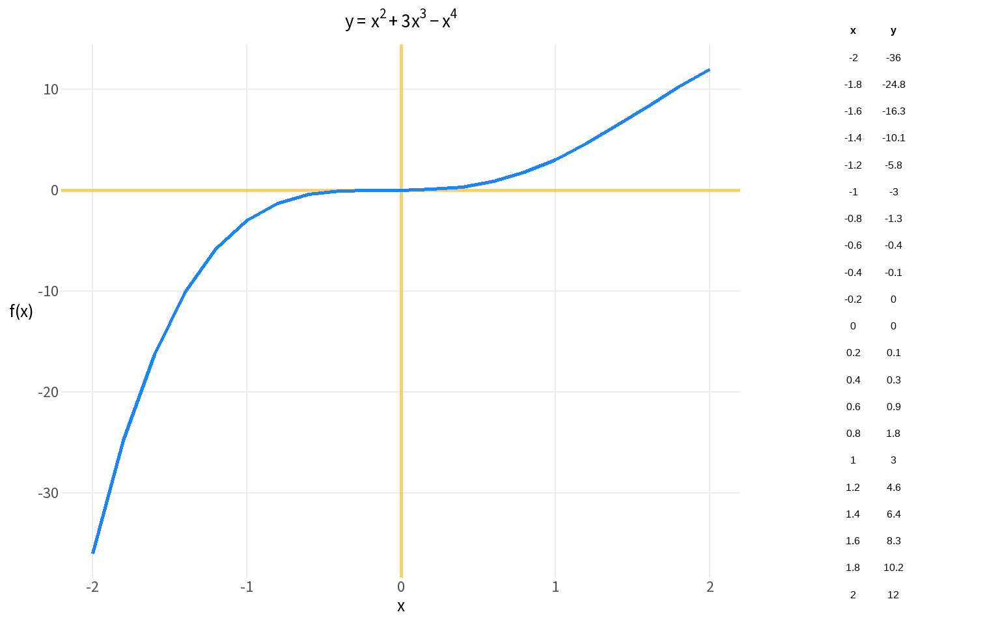

The Python version of this notebook compared **NumPy** (numerical arrays) with **SymPy** (symbolic algebra). In R, all arithmetic is vectorised by default — there is no separate "numeric" mode. For symbolic algebra, the `Ryacas` package offers a comparable workflow, but for this course the key skills are numerical evaluation and plotting, which base R handles naturally.

### Exercise 1

Graph the function $y=x^2+3x^3-x^4$


::: {.cell}

```{.r .cell-code}
x_domain  <- c(-2, 2)
num_steps <- 21
x <- seq(x_domain[1], x_domain[2], length.out = num_steps) 

# Direct vectorised evaluation — concise when you only need the values once
y <- x^2 + 3*x^3 - x^4
```
:::


Wrapping in a function adds value when you need reusability (e.g. passing to uniroot(), integrate(), or calling at multiple points)

In Python, SymPy represented the function symbolically before plotting

In R, wrapping the expression in `function()` achieves the same re-usability


::: {.cell}

```{.r .cell-code}
f <- function(x) x^2 + 3*x^3 - x^4
y <- f(x)

out <- tibble(x=x,y=y) %>%
    round(1) 

tbl_grob <- tableGrob(out,
                      rows=NULL,
                      theme = ttheme_minimal(base_size=12))

p <- ggplot(out, aes(x, y)) +
    geom_hline(yintercept = 0, 
               color="darkgoldenrod2",
               linewidth = 1,
               alpha=.5) +
    geom_vline(xintercept = 0, 
             color="darkgoldenrod2",
             linewidth=1,
             alpha=.5) +
    geom_line(linewidth = 1, color="dodgerblue2") +
    coord_cartesian(xlim = x_domain, ylim = range(y)) +
    labs(x = "x", y = "f(x)",
         title = expression(y == x^2 + 3*x^3 - x^4)) +
    base_grid +
    theme(axis.title.y = element_text(angle = 0, vjust = .5))

grid.arrange(p, tbl_grob, ncol = 2, widths = c(3, 1))
```

::: {.cell-output-display}
{width=768}
:::
:::


In Python, `sym.lambdify()` converted a SymPy expression into a callable numerical function. In R, functions are already callable — no conversion needed.


::: {.cell}

```{.r .cell-code}
# Evaluate at a single point (analogous to fx(2) after lambdify)
cat("f(2) =", f(2), "\n")
```

::: {.cell-output .cell-output-stdout}

```
f(2) = 12 
```


:::
:::

